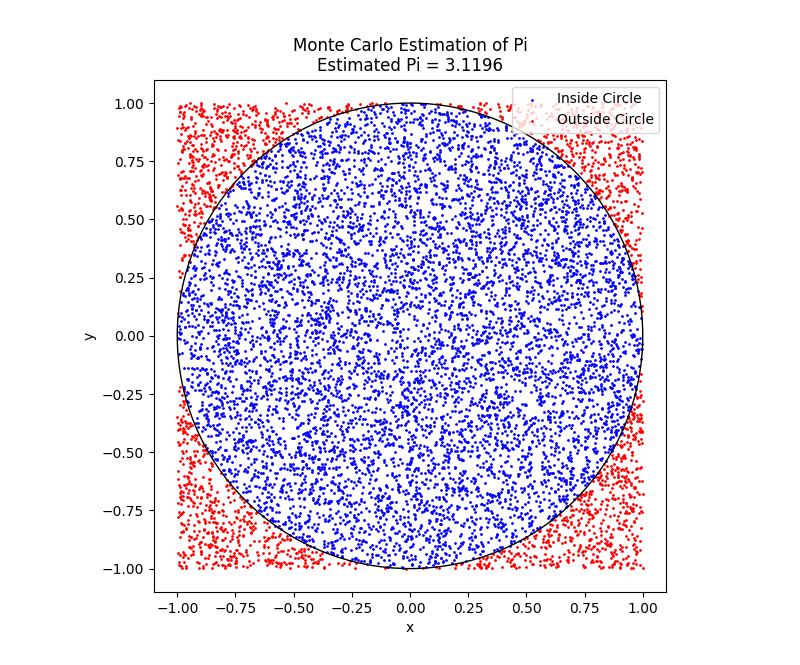

# Estimating Pi with Monte Carlo Simulation

## The Logic

Estimating π (pi) might sound complex, but it can be surprisingly straightforward using the Monte Carlo method. Here’s the logic behind it:

1. **Setup:** Imagine a circle inscribed in a square. For simplicity, use a circle with radius 1, inscribed in a 2x2 square (centered at the origin).

2. **Random Points:** Generate random points within the square. Each point is defined by its coordinates \((x, y)\).

3. **Inside the Circle:** Check whether each point falls inside the circle using the equation $(x^2 + y^2 = 1)$. This determines if the point is inside the circle.

4. **Estimate Pi:** The ratio of points inside the circle to the total number of points approximates the area of the circle relative to the square. Since the area of the circle is $\pi$ and the area of the square is 4, the ratio should be approximately $\pi/4$. Multiply this ratio by 4 to estimate π.

5. **Visualization:** Plot the points to visualize how the estimate improves as the number of points increases.

## What to Do

1. **Run the Simulation:** Use the provided Python code to generate random points, check if they fall inside the circle, and estimate π.

2. **Visualize the Results:** The code will plot the points and color them based on whether they are inside or outside the circle. Observe how the estimated value of π changes with more points.

3. **Experiment:** Modify the number of points to see how it affects the accuracy of the π estimate.

# How to Run the Pi Estimation Code

## Prerequisites

Before running the code, ensure you have Python installed on your system. You'll also need the following libraries:

- **NumPy**: For numerical operations.
- **Matplotlib**: For plotting the results.

You can install these libraries using pip if you don't have them already:

```bash
pip install numpy matplotlib
python monte_carlo_pi.py

```


Increase the number of samples to get a more accurate estimate of pi
