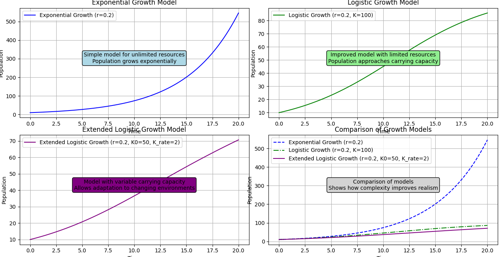

# Deriving Population Growth Models Using Differential Equations

Population growth can be modeled using differential equations that describe how the population changes over time. Here, we will derive the exponential and logistic growth models.

# What is covered in this document?

-  **[Exponential Growth Model](#1-exponential-growth-model)**
-  **[Logistic Growth Model](#2-logistic-growth-model)**
-  **[Extended Logistic Growth Model](#3-extended-logistic-growth-model)**
-  **[Prey-Predator Models](#4-prey-predator-models)**

## 1. Exponential Growth Model

### Differential Equation

The exponential growth model assumes that the rate of change of the population is proportional to the current population size. This can be expressed mathematically with the following differential equation:

$$
\frac{dP}{dt} = rP
$$

where:
- \( P(t) \) is the population at time \( t \),
- \( r \) is the constant growth rate.

### Solution

To solve this differential equation, we can use separation of variables:

1. Rearrange the equation:

   $$
   \frac{dP}{P} = r \, dt
   $$

2. Integrate both sides:

   $$
   \int \frac{1}{P} \, dP = \int r \, dt
   $$

   $$
   \ln|P| = rt + C
   $$

3. Solve for \( P \):

   $$
   P = e^{rt + C}
   $$

   Since \( e^C \) is a constant, we can rewrite it as \( P_0 \):

   $$
   P = P_0 e^{rt}
   $$

   where \( P_0 \) is the initial population at \( t = 0 \).

### Model

The exponential growth model is:

$$
P(t) = P_0 e^{rt}
$$

where:
- \( P_0 \) is the initial population,
- \( r \) is the growth rate,
- \( t \) is the time.

**Visualising the differential equation solution using Python**

**How does varying growth rate/fertility affect graphs**

### REALLY?

**Why does it not happen in real life? What are we missing in our simple model?**

**Shortcomings:**

1. **Unrealistic Long-Term Growth:** 
   - The exponential model assumes that the growth rate remains constant indefinitely. In reality, resources such as food, space, and other environmental factors limit the growth of populations or quantities. As a result, the exponential model often predicts unrealistic, infinite growth over time.

2. **No Carrying Capacity:**
   - The model lacks a concept of carrying capacity—the maximum population size that the environment can sustain. This oversight means the model does not account for the fact that growth will slow down as resources become scarce.

3. **Simplified Dynamics:**
   - The exponential model does not consider interactions with other factors or species, such as competition or predation, which can significantly influence growth. (mostly not an issue with humans)

## 2. Logistic Growth Model

### Differential Equation

The logistic growth model incorporates a carrying capacity \( K \), representing the maximum population size the environment can sustain. The rate of change of the population is proportional to both the current population and the difference between the carrying capacity and the current population:

$$
\frac{dP}{dt} = rP \left(1 - \frac{P}{K}\right)
$$

where:
- \( K \) is the carrying capacity,
- \( r \) is the growth rate,Basic_population_growth.png
- \( P \) is the population.

### Solution

To solve this differential equation, follow these steps:

1. Rearrange and separate variables:

   $$
   \frac{dP}{P \left(1 - \frac{P}{K}\right)} = r \, dt
   $$

2. Use partial fraction decomposition to integrate:

   $$
   \frac{1}{P \left(1 - \frac{P}{K}\right)} = \frac{1}{P} + \frac{1}{K - P}
   $$

   Thus:

   $$
   \int \left(\frac{1}{P} + \frac{1}{K - P}\right) dP = \int r \, dt
   $$

3. Integrate both sides:

   $$
   \ln \left| \frac{P}{K - P} \right| = rt + C
   $$

4. Solve for \( P \):

   $$
   \frac{P}{K - P} = e^{rt + C}
   $$

   Rewriting \( e^C \) as \( C' \):

   $$
   \frac{P}{K - P} = C' e^{rt}
   $$

   Solving for \( P \):

   $$
   P = \frac{KC' e^{rt}}{1 + C' e^{rt}}
   $$

   where \( C' \) is a constant determined by initial conditions.

### Model

The logistic growth model is:

$$
P(t) = \frac{K}{1 + \frac{K - P_0}{P_0} e^{-rt}}
$$

where:
- \( P_0 \) is the initial population,
- \( r \) is the growth rate,
- \( K \) is the carrying capacity,
- \( t \) is the time.

With these models, you can simulate and visualize population growth in different scenarios and understand the dynamics of how populations evolve over time.

### Improvements Offered:

1. **Realistic Growth Limitation:**
   - The logistic model incorporates a carrying capacity $ K $, representing the maximum population size the environment can support. As the population approaches this limit, the growth rate slows down and eventually stabilizes. This provides a more realistic representation of growth over time.

2. **Adjustment for Resource Constraints:**
   - By including the term $ \left(1 - \frac{P}{K}\right) $, the logistic model accounts for the diminishing availability of resources as the population increases. This makes it more applicable to real-world scenarios where resources are finite.

### Shortcomings

- **Rigid dynamics:**  Assumes a constant carrying capacity and does not account for changes in the environment or resources over time. The model may not capture the complexities of varying resources, predation, or environmental changes.

## 3. Extended Logistic Growth Model

In the extended logistic growth model, the carrying capacity changes over time, reflecting more complex real-world scenarios.

**Differential Equation:**
$$
\frac{dP}{dt} = r \cdot P \cdot \left(1 - \frac{P}{K(t)}\right)
$$
where \( K(t) \) varies linearly:
$$
K(t) = K_0 + K_{\text{rate}} \cdot t
$$

**Parameters:**
- $K_0$: Initial carrying capacity
- $K_{\text{rate}}$: Rate at which the carrying capacity increases

### Think about how you can solve this ODE?
I have used python's available solvers to solve it and now we can compare results from various plots.

**Comparing all the models discussed here**

##  Can we model PANDEMICS?
- [SIRD_model](https://www.nature.com/articles/s41598-022-16496-6)

## 4. Prey-Predator models

## Assumptions

### Population Dynamics
- **Homogeneous Mixing**: Wolves and sheep are uniformly mixed within the environment.
- **Continuous Population Change**: Populations change smoothly over time.
- **Closed System**: No immigration or emigration; changes are due to births, deaths, and predation within the system.

### Sheep (Prey) Population
- **Logistic Growth**: Sheep follow logistic growth in the absence of predation, approaching a carrying capacity ($K_s$).
- **Carrying Capacity ($K_s$)**: The maximum number of sheep that the environment can support.
- **Predation Rate ($\alpha$)**: The rate of sheep being consumed is proportional to both sheep and wolf populations.

### Wolves (Predator) Population
- **Predator Dependence on Prey**: Wolf population growth depends on the availability of sheep.
- **Death Rate ($\delta$)**: Wolves have a constant death rate.
- **Proportional Growth ($\beta$)**: The rate of wolf reproduction is proportional to the number of sheep consumed.

### Interaction
- **No Alternative Food Sources**: Wolves rely entirely on sheep for food.
- **No Time Delays**: Immediate effects of predation on both populations.
- **No Environmental Changes**: The environment remains constant over time.

### Biological and Ecological
- **Constant Birth and Death Rates**: Rates remain unchanged over time.
- **No Disease or External Threats**: Neither population is affected by external factors.

### Mathematical Modeling
- **Deterministic Model**: Outcomes are fully determined by the parameters and initial conditions.
- **Simple Functional Forms**: Interactions are represented by simple proportional relationships.

## Differential Equations

Let:
- $S(t)$: Sheep population at time $t$.
- $W(t)$: Wolf population at time $t$.
- $r_s$: Growth rate of the sheep.
- $K_s$: Carrying capacity of the sheep.
- $\alpha$: Predation rate, proportional to the interaction between sheep and wolves.
- $\beta$: Rate at which sheep consumption increases the wolf population.
- $\delta$: Death rate of the wolves.

### Sheep Population:
$$
\frac{dS}{dt} = r_s S \left(1 - \frac{S}{K_s}\right) - \alpha S W
$$

### Wolf Population:
$$
\frac{dW}{dt} = \beta \alpha S W - \delta W
$$

- where $ \alpha S W$ represents number of sheep killed by wolves
- $\beta \alpha S W$ represents number of wolves increasing on consuming sheep

These equations represent the interaction between the wolf and sheep populations over time, where the sheep population grows logistically and is reduced by predation, while the wolf population grows by consuming sheep and declines due to natural deaths.

## Simulation results

